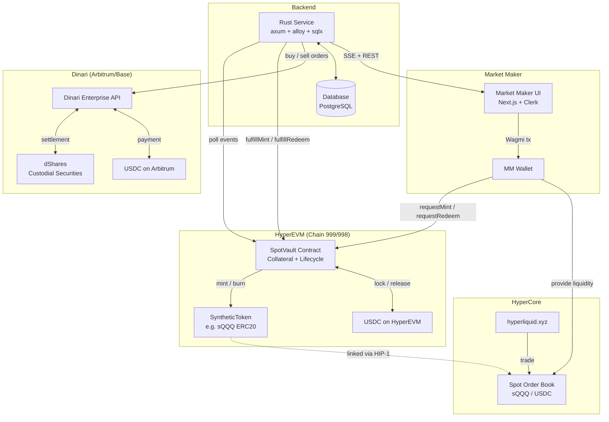
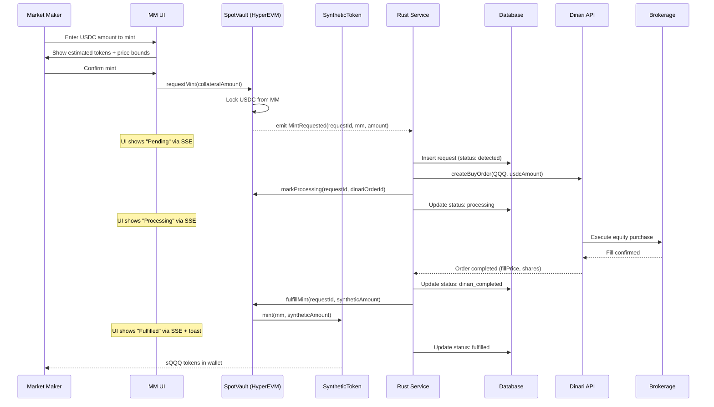
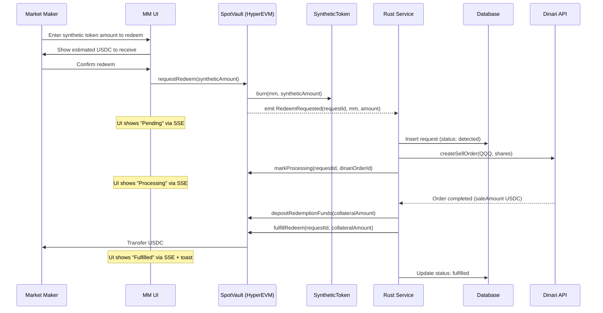
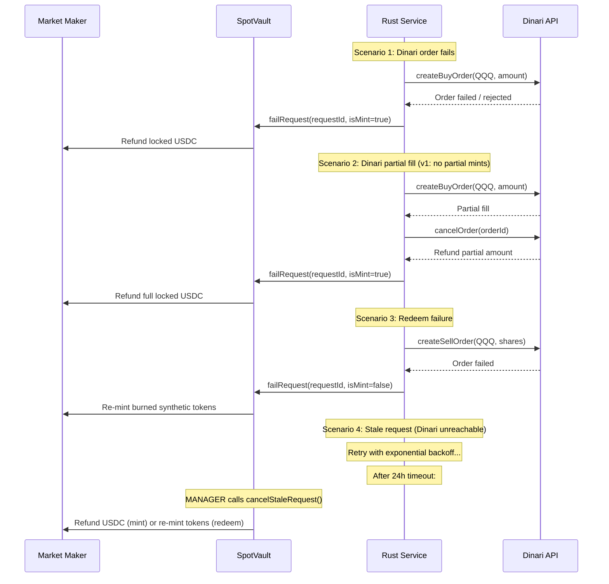
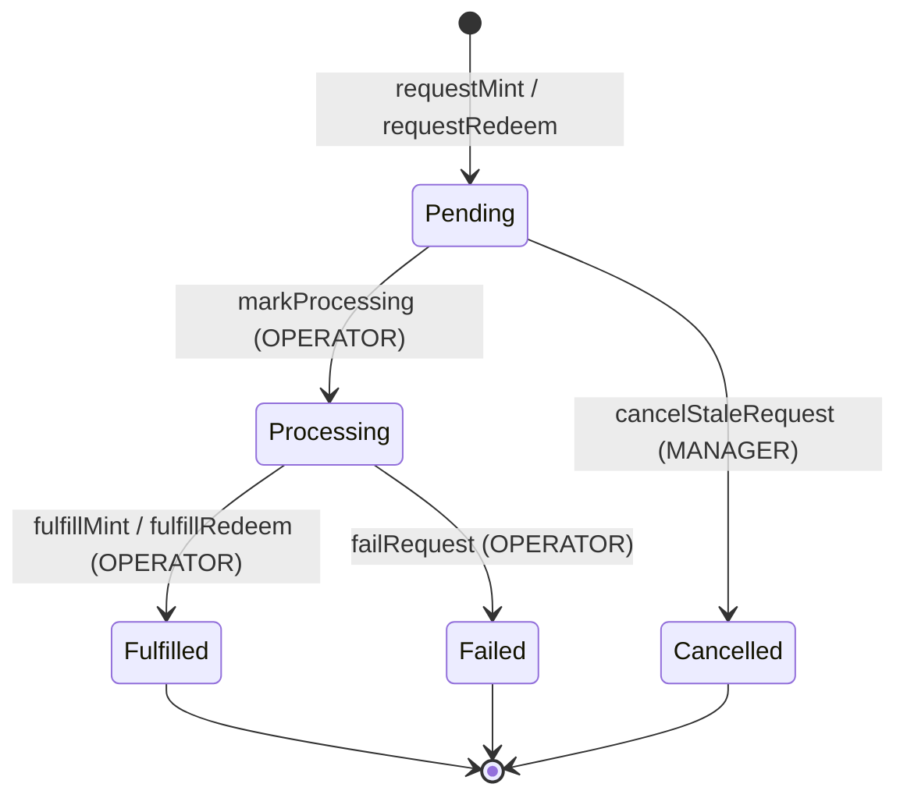
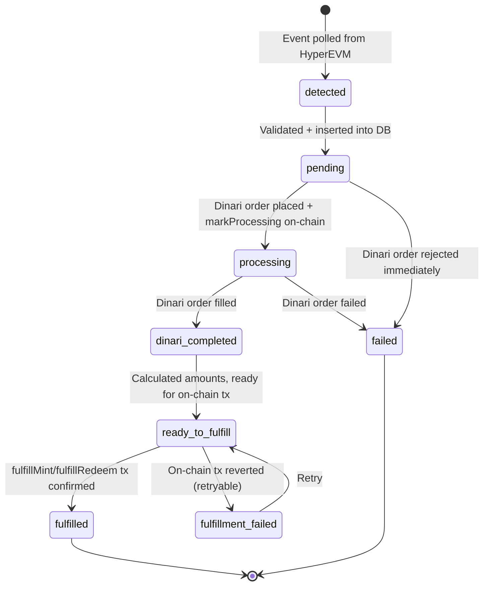
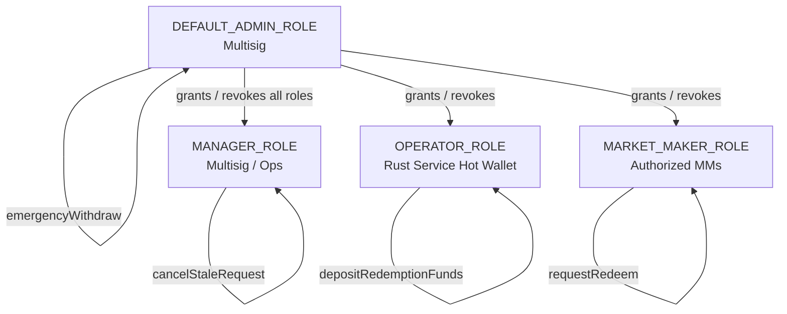
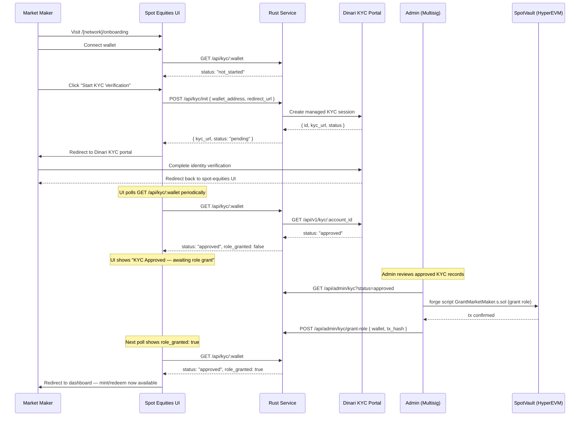

# Spot Equities on Hyperliquid — Architecture

Tokenized equity spot markets on Hyperliquid, powered by Dinari dShares. Market makers mint and redeem synthetic equity tokens on HyperEVM, backed 1:1 by custodial dShares. These synthetic tokens trade on HyperCore's centralized order book.

## System Overview

The system has four major components:

1. **Smart Contracts (HyperEVM)** — `SyntheticToken` (ERC20) and `SpotVault` (request lifecycle, collateral management, access control). Deployed on HyperEVM (chain 999 mainnet / 998 testnet).

2. **Rust Backend Service** — Bridges HyperEVM and the Dinari API. Listens for on-chain mint/redeem events, executes buy/sell orders via Dinari, and fulfills requests back on-chain. Exposes a REST API + SSE for the UI.

3. **Dinari Infrastructure** — Custodial tokenized securities (dShares) on Arbitrum/Base. Provides the Dinari Enterprise API for programmatic buy/sell of dShares backed by real equities.

4. **Market Maker UI** — Next.js app with Clerk auth, real-time position tracking, mint/redeem workflows, and request monitoring via SSE.



## User Flows

### Mint Flow

A market maker deposits USDC to receive synthetic equity tokens.



### Redeem Flow

A market maker burns synthetic tokens to receive USDC.



### Failure / Rollback Flow



## Request State Machine

### On-Chain States (SpotVault)



### Off-Chain States (Rust Service Database)

More granular than on-chain to track Dinari order lifecycle:



## Role Hierarchy



## Smart Contract Interfaces

### SyntheticToken.sol

Upgradeable ERC20 following the KHYPE pattern. Supports mint/burn with role-based access control and pause functionality via PauserRegistry.

```solidity
interface ISyntheticToken {
    function initialize(
        string calldata name,      // e.g. "Synthetic QQQ"
        string calldata symbol,    // e.g. "sQQQ"
        address admin,             // DEFAULT_ADMIN_ROLE
        address minter,            // SpotVault address (MINTER_ROLE)
        address burner,            // SpotVault address (BURNER_ROLE)
        address pauserRegistry     // PauserRegistry address
    ) external;

    function mint(address to, uint256 amount) external;   // MINTER_ROLE only
    function burn(address from, uint256 amount) external;  // BURNER_ROLE only
}
```

### SpotVault.sol

Core contract managing the mint/redeem request lifecycle.

```solidity
interface ISpotVault {
    // ── Enums & Structs ──
    enum RequestStatus { Pending, Processing, Fulfilled, Failed, Cancelled }

    struct MintRequest {
        address requester;
        uint256 collateralAmount;
        uint256 syntheticAmount;
        uint256 timestamp;
        RequestStatus status;
        bytes32 dinariOrderId;
    }

    struct RedeemRequest {
        address requester;
        uint256 syntheticAmount;
        uint256 collateralAmount;
        uint256 timestamp;
        RequestStatus status;
        bytes32 dinariOrderId;
    }

    // ── Events ──
    event MintRequested(uint256 indexed requestId, address indexed requester, uint256 collateralAmount);
    event MintProcessing(uint256 indexed requestId, bytes32 dinariOrderId);
    event MintFulfilled(uint256 indexed requestId, uint256 syntheticAmount);
    event MintFailed(uint256 indexed requestId);
    event RedeemRequested(uint256 indexed requestId, address indexed requester, uint256 syntheticAmount);
    event RedeemProcessing(uint256 indexed requestId, bytes32 dinariOrderId);
    event RedeemFulfilled(uint256 indexed requestId, uint256 collateralAmount);
    event RedeemFailed(uint256 indexed requestId);

    // ── Market Maker Functions ──
    function requestMint(uint256 collateralAmount) external returns (uint256 requestId);
    function requestRedeem(uint256 syntheticAmount) external returns (uint256 requestId);

    // ── Operator Functions ──
    function markProcessing(uint256 requestId, bool isMint, bytes32 dinariOrderId) external;
    function fulfillMint(uint256 requestId, uint256 syntheticAmount) external;
    function fulfillRedeem(uint256 requestId, uint256 collateralAmount) external;
    function failRequest(uint256 requestId, bool isMint) external;
    function depositRedemptionFunds(uint256 amount) external;

    // ── Manager Functions ──
    function setPriceBounds(uint256 min, uint256 max) external;
    function setMaxMintAmount(uint256 amount) external;
    function setMaxRedeemAmount(uint256 amount) external;
    function cancelStaleRequest(uint256 requestId, bool isMint) external;

    // ── Admin Functions ──
    function emergencyWithdraw(address token, uint256 amount) external;
}
```

## Rust Backend Service

### Stack

| Crate | Purpose |
|-------|---------|
| `axum` | HTTP server (REST API + SSE) |
| `alloy` | EVM interactions (event listening, tx submission) |
| `reqwest` | HTTP client for Dinari API |
| `sqlx` | Async database (PostgreSQL prod / SQLite dev) |
| `tokio` | Async runtime |
| `serde` / `envy` | Config + serialization |
| `tracing` | Structured logging |
| `tower-http` | CORS, tracing middleware |

### REST API Endpoints

| Method | Path | Auth | Description |
|--------|------|------|-------------|
| `GET` | `/api/requests` | Clerk JWT | List requests (filter by status, type, requester) |
| `GET` | `/api/requests/:id` | Clerk JWT | Single request detail |
| `GET` | `/api/positions` | Clerk JWT | MM's token balances + pending requests |
| `GET` | `/api/treasury` | Clerk JWT (Manager) | Backing ratio, USDC available, dShares held |
| `GET` | `/api/stats` | Clerk JWT | Aggregate stats (total minted, redeemed, volume) |
| `GET` | `/api/health` | None | Service health check |
| `GET` | `/api/events` | Clerk JWT | SSE stream for real-time updates |

### SSE Event Types

| Event | Payload | Trigger |
|-------|---------|---------|
| `request:created` | `{ requestId, type, requester, amount }` | New on-chain event detected |
| `request:updated` | `{ requestId, status, dinariOrderId?, amounts? }` | Status change |
| `treasury:updated` | `{ backingRatio, usdcAvailable }` | Treasury snapshot |
| `heartbeat` | `{}` | Every 15 seconds |

### Settlement Engine Loop

Runs every ~5 seconds as a tokio task:

1. **Poll events** — `eth_getLogs` from last processed block for `MintRequested` / `RedeemRequested` events
2. **Process pending** — Place Dinari buy/sell orders, call `markProcessing` on-chain
3. **Check processing** — Poll Dinari order status, transition to `dinari_completed` on fill
4. **Fulfill completed** — Submit `fulfillMint` / `fulfillRedeem` tx on-chain
5. **Broadcast updates** — Push SSE events for any status changes

### Database Schema

```sql
-- Request lifecycle tracking
CREATE TABLE requests (
    id              BIGSERIAL PRIMARY KEY,
    request_id      BIGINT NOT NULL UNIQUE,        -- On-chain request ID
    request_type    TEXT NOT NULL,                  -- 'mint' | 'redeem'
    requester       TEXT NOT NULL,                  -- MM address
    collateral_amount TEXT NOT NULL,                -- USDC amount (decimal string)
    synthetic_amount TEXT,                          -- Token amount (set at fulfillment)
    status          TEXT NOT NULL DEFAULT 'detected',
    dinari_order_id TEXT,
    dinari_status   TEXT,
    dinari_fill_price TEXT,
    dinari_fill_shares TEXT,
    onchain_tx_hash TEXT,                           -- Fulfillment tx hash
    retry_count     INTEGER NOT NULL DEFAULT 0,
    last_error      TEXT,
    created_at      TIMESTAMPTZ NOT NULL DEFAULT NOW(),
    updated_at      TIMESTAMPTZ NOT NULL DEFAULT NOW()
);

-- Block cursor for event listener
CREATE TABLE block_cursor (
    id                    INTEGER PRIMARY KEY DEFAULT 1,
    last_processed_block  BIGINT NOT NULL DEFAULT 0,
    updated_at            TIMESTAMPTZ NOT NULL DEFAULT NOW()
);

-- Treasury health snapshots
CREATE TABLE treasury_snapshots (
    id                    BIGSERIAL PRIMARY KEY,
    dinari_usdc_balance   TEXT NOT NULL,
    dinari_dshares_held   TEXT NOT NULL,            -- JSON: { "QQQ": "123.45" }
    synthetic_outstanding TEXT NOT NULL,
    backing_ratio         TEXT NOT NULL,
    created_at            TIMESTAMPTZ NOT NULL DEFAULT NOW()
);
```

## Market Maker UI

### Tech Stack

- **Framework:** Next.js 16 (App Router)
- **Auth:** Clerk with organization scoping
- **UI:** `@kinetiq-research/design-system` (Radix + Tailwind CSS v4)
- **Web3:** Wagmi 3.6.1 via `@kinetiq-research/wagmi-config`
- **Data:** TanStack Query v5 + SSE for real-time
- **Notifications:** sonner (toast)
- **Charts:** recharts

### Route Structure

| Route | Description | Access |
|-------|-------------|--------|
| `/sign-in` | Clerk sign-in | Public |
| `/[network]/dashboard` | Position overview, stats, recent activity | MARKET_MAKER_ROLE |
| `/[network]/mint` | Deposit USDC → request mint workflow | MARKET_MAKER_ROLE |
| `/[network]/redeem` | Burn tokens → request redeem workflow | MARKET_MAKER_ROLE |
| `/[network]/requests` | Request history with real-time status | MARKET_MAKER_ROLE |
| `/[network]/treasury` | Treasury health, backing ratio charts | MANAGER_ROLE |
| `/settings` | Organization & account settings | Authenticated |

`[network]` is `mainnet` or `testnet`, controlling which chain + service instance is used.

## Environment Configuration

### Contracts

| Variable | Testnet | Mainnet |
|----------|---------|---------|
| `HYPEREVM_CHAIN_ID` | `998` | `999` |
| `HYPEREVM_RPC` | `https://rpc.hyperliquid-testnet.xyz/evm` | `https://rpc.hyperliquid.xyz/evm` |
| `SPOT_VAULT_ADDRESS` | Testnet deploy address | Mainnet deploy address |
| `SYNTHETIC_TOKEN_ADDRESS` | Testnet deploy address | Mainnet deploy address |
| `COLLATERAL_TOKEN_ADDRESS` | Testnet USDC | Mainnet USDC |

### Rust Service

| Variable | Description |
|----------|-------------|
| `DATABASE_URL` | PostgreSQL connection string |
| `HYPEREVM_RPC_URL` | HyperEVM RPC endpoint |
| `VAULT_CONTRACT_ADDRESS` | SpotVault address |
| `OPERATOR_PRIVATE_KEY` | Hot wallet private key |
| `DINARI_API_URL` | `api-staging.sbt.dinari.com` or `api-enterprise.sbt.dinari.com` |
| `DINARI_API_KEY_ID` | Dinari API key |
| `DINARI_API_SECRET` | Dinari API secret |
| `DINARI_CHAIN_ID` | Arbitrum (42161) or Arbitrum Sepolia (421614) |
| `CLERK_JWKS_URL` | Clerk JWKS endpoint for JWT validation |
| `POLL_INTERVAL_MS` | Event poll interval (default: 2000) |
| `SETTLEMENT_INTERVAL_MS` | Engine tick interval (default: 5000) |

### UI (Next.js)

| Variable | Description |
|----------|-------------|
| `NEXT_PUBLIC_CLERK_PUBLISHABLE_KEY` | Clerk publishable key |
| `NEXT_PUBLIC_SERVICE_URL_TESTNET` | Rust service URL (testnet) |
| `NEXT_PUBLIC_SERVICE_URL_MAINNET` | Rust service URL (mainnet) |
| `NEXT_PUBLIC_VAULT_ADDRESS_TESTNET` | SpotVault address (testnet) |
| `NEXT_PUBLIC_VAULT_ADDRESS_MAINNET` | SpotVault address (mainnet) |

## Testnet vs Mainnet

| Aspect | Testnet | Mainnet |
|--------|---------|---------|
| HyperEVM chain | 998 | 999 |
| Dinari API | Staging / sandbox (partners.dinari.com) | Production |
| USDC | Testnet faucet tokens | Real USDC |
| dShares | Test dShares (instant fill, no real settlement) | Real securities (T+1 settlement) |
| Price bounds | Wide (for testing) | Tight (~5% around market price) |
| Staleness threshold | Short (1 hour) | Long (24 hours) |
| Operator wallet | Test wallet with testnet funds | Secured hot wallet |
| Admin | Test EOA | Multisig |
| Treasury | Mock balances | Pre-funded Arbitrum account |

## KYC Onboarding Flow

Market makers must complete KYC through Dinari before they can mint/redeem. KYC approval is a prerequisite; an admin then manually grants `MARKET_MAKER_ROLE` on-chain.



### KYC States

| Status | Description |
|--------|-------------|
| `not_started` | Wallet has no KYC record |
| `pending` | KYC session created, user redirected to Dinari |
| `in_review` | User submitted documents, Dinari is reviewing |
| `approved` | KYC approved by Dinari |
| `rejected` | KYC rejected (reason stored) |

### Admin Role Grant Runbook

**Prerequisites:**
- Admin holds `DEFAULT_ADMIN_ROLE` on SpotVault
- Market maker's KYC status is `approved` in the service database

**Step 1:** List approved wallets awaiting role grant:
```bash
curl $SERVICE_URL/api/admin/kyc?status=approved | jq '.records[] | select(.role_granted == false)'
```

**Step 2:** Grant `MARKET_MAKER_ROLE` on-chain:
```bash
forge script script/GrantMarketMaker.s.sol \
  --sig "run(address,address)" \
  $VAULT_ADDRESS $MARKET_MAKER_ADDRESS \
  --rpc-url $HYPEREVM_RPC_URL \
  --private-key $ADMIN_PRIVATE_KEY \
  --broadcast
```

**Step 3:** Record the grant in the service (with the tx hash from step 2):
```bash
curl -X POST $SERVICE_URL/api/admin/kyc/grant-role \
  -H "Content-Type: application/json" \
  -d '{"wallet_address": "$MARKET_MAKER_ADDRESS", "tx_hash": "$TX_HASH"}'
```

**Batch Grant** (multiple wallets at once):
```bash
forge script script/GrantMarketMaker.s.sol \
  --sig "batchGrant(address,address[])" \
  $VAULT_ADDRESS "[$ADDR1,$ADDR2,$ADDR3]" \
  --rpc-url $HYPEREVM_RPC_URL \
  --private-key $ADMIN_PRIVATE_KEY \
  --broadcast
```

**Revoking Access:**
```bash
forge script script/GrantMarketMaker.s.sol \
  --sig "revoke(address,address)" \
  $VAULT_ADDRESS $MARKET_MAKER_ADDRESS \
  --rpc-url $HYPEREVM_RPC_URL \
  --private-key $ADMIN_PRIVATE_KEY \
  --broadcast
```

### KYC API Endpoints

| Method | Path | Auth | Description |
|--------|------|------|-------------|
| `POST` | `/api/kyc/init` | Clerk JWT | Create Dinari KYC session, return redirect URL |
| `GET` | `/api/kyc/:wallet_address` | Clerk JWT | Get KYC status (refreshes from Dinari if pending) |
| `GET` | `/api/admin/kyc` | Clerk JWT (Admin) | List all KYC records, filterable by status |
| `POST` | `/api/admin/kyc/grant-role` | Clerk JWT (Admin) | Record on-chain role grant with tx hash |

## Security Model

### Threat Mitigation

| Threat | Mitigation |
|--------|-----------|
| Operator key compromise | Price bounds limit minting at wrong prices. Manager can revoke OPERATOR_ROLE immediately. |
| Double fulfillment | Atomic on-chain status transition (Processing → Fulfilled). Second call reverts. |
| Dinari order failure after USDC locked | `failRequest` refunds USDC (mint) or re-mints tokens (redeem). |
| Stale requests | Manager can `cancelStaleRequest` after timeout. |
| Service crash mid-flow | Idempotent Dinari calls (requestId-based keys). DB state reconciled with on-chain state on restart. |
| Undercollateralization | Treasury reconciler monitors backing ratio. Alerts on deviation from 1:1. |
| Contract vulnerability | Upgradeable contracts (UUPS) allow patching. Emergency pause via PauserRegistry. |

### Access Control Summary

| Action | Required Role | Contract |
|--------|--------------|----------|
| Mint synthetic tokens | MINTER_ROLE (SpotVault only) | SyntheticToken |
| Burn synthetic tokens | BURNER_ROLE (SpotVault only) | SyntheticToken |
| Request mint/redeem | MARKET_MAKER_ROLE | SpotVault |
| Fulfill/fail requests | OPERATOR_ROLE | SpotVault |
| Set price bounds & caps | MANAGER_ROLE | SpotVault |
| Cancel stale requests | MANAGER_ROLE | SpotVault |
| Emergency withdraw | DEFAULT_ADMIN_ROLE | SpotVault |
| Grant/revoke roles | DEFAULT_ADMIN_ROLE | Both |
| Pause contracts | PAUSER_ROLE | PauserRegistry |
